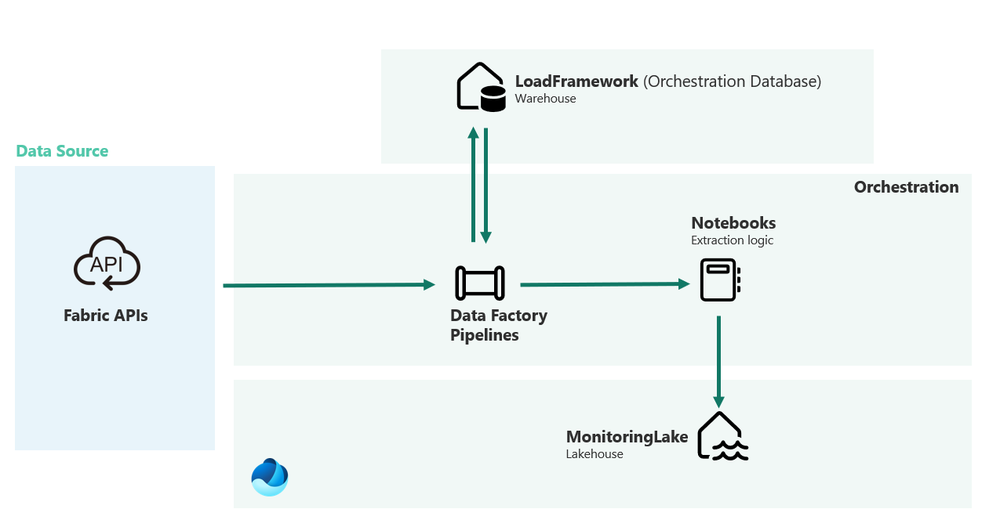

# Overview

This wiki page provides a high-level overview of the current solution and how it leverages several new Microsoft Fabric capabilities.

## Key Components Used

- **Warehouse**
- **Lakehouse**
- **Data Factory**
- **Notebooks**

## How the Solution Works

A **Warehouse** item named `LoadFramework` is created to support the data loading process. It also provides a logging mechanism for the Data Factory pipelines.  
> **Note:** This warehouse is *not* used to store extracted data or serve as a traditional data warehouse or datamart. Work is in progress to replace it with a Fabric SQL Database.

The extracted data is stored in a **Lakehouse** item called `MonitoringLake`, which serves as the central data repository.

Data extractions are driven by **Data Factory** pipelines, starting with a pipeline named `pl_monitoring_master`. These pipelines rely on configurations stored in the `LoadFramework` database to determine:

- What data to extract
- How to run the extraction

Each configuration includes specific inputs needed for orchestration and notebook execution.  
For example, a configuration might be designed to extract only audit logs and would include only the relevant parameters for that task.

> Check the `Insert Config - Initialization.sql` file in the `resources` folder for an example. 

The extraction logic is implemented in **Notebooks**, primarily written in Python. In some cases, they may also include **Spark SQL** queries to interact with data stored in the lakehouse.

# Architecture

  

<em>Figure 1: High-level architecture overview</em>

# Azure Setup & Load Framework

## Azure Setup

This solution makes use of the following Azure components:

- **Service Principals**
- **Azure Key Vault**

### Service Principals

The solution uses two different **Service Principals**, each configured with specific API permissions.

Depending on the type of operation being performed in the notebooks, authentication with the fabric api may require one or both of these SPNs.

- **Fabric SPN**

  This is an SPN that does not require admin consent at the tenant level. It uses the following API permissions:

  

<em>Figure 2: Fabric SPN API permissions</em>

- **Fabric SPN Admin Consent**

  This is an SPN that requires admin consent at the tenant level. It uses the following API permissions:

  

<em>Figure 2: Fabric SPN Amin Consent - API permissions</em>

### Azure Key Vault

An **Azure Key Vault** is required for the solution. It will hold secrets for authenticating with the Fabric APIs.

In a key vault of your choice, create the following secrets:

 

  | Secret Name | Secret Value | Comment |
  | -------- | ------- | ------- |
  | AzureTenantId | <strong>your azure tenant id</strong> |  |
  | DomainName | <strong>your domain name</strong> |  |
  | FabricSpnId | <strong>the client id of the Fabric SPN app</strong> |  |
  | FabricSpnSecret | <strong>the secret of the Fabric SPN app</strong> |  |
  | FabricSpnAdminConsentId | <strong>the client id of the Fabric SPN Admin Consent app</strong> |  |
  | FabricSpnAdminConsentSecret | <strong>the secret of the Fabric SPN Admin Consent app</strong> |  |
  | FabricSecurityGroupId | <strong> security group id</strong> | a security group in which the 2 fabric SPNs are added |

 

# LoadFramework database

## Tables

This is the list of tables used in the LoadFramework database:

 

| **Database Schema** | **Table** | **Column**| **Description** |
|--|--|--|--|
| dbo| Config |  | The dbo.Config table will hold the configuration id and name. Each configuration is unique and has a relationship to the other configuration tables like the dbo.ConfigAudit. Configuarations are used to trigger some or all of the activities in the pipelines|
| |  | ConfigId | Configuration unique identifier |
| |  | ConfigName | Configuration name|
| |  | CreatedBy | Created by user |
| |  | CreatedDate | Created date |
| |  | IsCurrent | Flag to identify if current record is the valid version (in case of duplicated configuration name) |
|--|--|--|--|
| dbo| ConfigAudit |  | The dbo.ConfigAudit table will hold specific inputs related to the audit log extraction |
| |  | ConfigId | Configuration unique identifier |
| |  | AuditLogTimeframeInMinutes | Time frame in minutes for the incremental extraction of audit logs |
| |  | AllActivities | A flag (yes/no) to extract all audit log activities |
| |  | Initialization | A flag (yes/no) that initialize the audit log extraction |
| |  | LastProcessedDateAndTime | The last timestamp the audit log was extracted |
|--|--|--|--|
| dbo| ConfigAzure |  |  The dbo.ConfigAzure table will hold information about the Azure items likes the name of the key vault and the secrets used for authentication |
| |  | ConfigId | Configuration unique identifier |
| |  | keyVaultName | The key vault **name** |
| |  | TenantId | The **name** of the key vault secret containing the **tenant id** |
| |  | DomainName | The **name** of the key vault secret containing the **domain name** |
| |  | FabricSpnClientId | The **name** of the key vault secret containing the client id of **Fabric SPN** |
| |  | FabricSpnSecret | The **name** of the key vault secret containing the secret value of **Fabric SPN** |
| |  | FabricSpnAdminConsentClientId | The **name** of the key vault secret containing the client id of **Fabric SPN Admin Consent** |
| |  | FabricSpnAdminConsentSecretName | The **name** of the key vault secret containing the secret value of **Fabric SPN Admin Consent** |
| |  | FabricSecurityGroupId | The **name** of the key vault secret containing the security group id |
|--|--|--|--|
| dbo| ConfigDate |  | The dbo.ConfigDate table will hold information about the date table that will be created as part of the reporting solution |
| |  | ConfigId | Configuration unique id |
| |  | EndDate | Start Date |
| |  | StartDate | End Date |
|--|--|--|--|
| dbo| ConfigInventory |  | The dbo.ConfigInventory table will hold specific inputs related to the audit log extraction related to the inventory (workspaces, datasets, reports, etc..) extraction |
| |  | ConfigId | Configuration unique identifier |
| |  | Initialization | A flag (yes/no) that initialize the inventory extraction  |
| |  | ThrottleScanApi | A flag (yes/no) that identifies if a throttle to the scanner api is required |
| |  | LastProcessedDateAndTime | A timestamp that identifies the last time the inventory was extracted. Used for incremental extraction |
| |  | ExportTenantMetadata | A flag (yes/no) that identifies if the extraction of tenant level metadata is required |
| |  | ExportGatewayClusters | Flag that identifies if the extraction gateways is required |
| |  | ExportInventory | A flag (yes/no) that identifies if the extraction workspaces and their inventory is required |
| |  | ExportDatasetRefreshHistory | A flag (yes/no) that identifies if the dataset refresh history extraction is required |
| |  | TopNRefreshHistory | A flag (yes/no) that identifies how many records to retrieve for the dataset refresh history |
|--|--|--|--|
| dbo| Load |  | The dbo.Load table will hold the loads that identify a current execution of data factory pipelines. This load will also be used when logging the notebook executions |
| |  | LoadId | The load unique identifier |
| |  | ModuleRunId | The data factory run id |
| |  | PipelineTriggerDt | The data factory pipeline trigger datetime |
| |  | PipelineStatus | The data factory pipeline execution status (failed, succeeded, cancelled) |
| |  | TriggerId | The data factory pipeline trigger id |
| |  | Module | The name module. At this moment there is only one module called **fabric-monitoring** |
| |  | StartDate | Start datetime of the current load execution |
| |  | EndDate | End datetime of the current load execution |
| |  | EntRunId | The data factory run id |
| |  | LastUpdate | The last time the load id has been updated |
| |  | CreatedBy | Created by user |
|--|--|--|--|
| dbo| LoadLog |  | The dbo.LoadLog table will hold the log related to the load. This is high level log that tracks the activities that are executed during the load |
| |  | LoadLogId | The load log unique identifier |
| |  | LoadId | The load unique identifier |
| |  | PipelineName | The name of the current pipeline executed |
| |  | InvokedPipeline | The name of the pipeline invoked in the current pipeline |
| |  | InvokedNotebook | The name of the notebook invoked in the current pipeline |
| |  | LoadStatus | The status of the log |
| |  | LastUpdate | The timestamp of the current step |
| |  | CreatedBy | Created by user |

There are additional tables in this database related to on-going developments. They will be documented at a later stage:
- dbo.ConfigCapacityMetrics
- dbo.ConfigKusto

## Views

The `LoadFramework` database includes a single view, `dbo.vwConfig`, which combines data from multiple configuration tables into a unified list of configurations along with their associated attributes.
 

## Stored procedures

The `LoadFramework` database contains several stored procedures that support configuration management, load tracking, and logging for the data extraction process.

---

### `dbo.spGetConfig`

**Description:**  
Retrieves a specific configuration and its properties using the `dbo.vwConfig` view. It generates a single json structure containing all the required properties of the configuration.

**Parameters:**
- `ConfigName`: the name of the configuration to retrieve.

---

### `dbo.spGetLoad`

**Description:**  
Retrieves the most recent load based on the current runtime and module.

**Parameters:**
- `ModuleRunId`: the ID of the current pipeline run.
- `Module`: the name of the current module.

---

### `dbo.spInsertLoad`

**Description:**  
Creates a new load entry in dbo.Load table.

**Parameters:**
- `ModuleRunId`: the pipeline run ID.
- `PipelineTriggerDT`: the pipeline trigger timestamp.
- `TriggerId`: the pipeline trigger ID.
- `Module`: the name of the module.
- `StartDate`: the load start time (typically the pipeline trigger time).
- `EntRunId`: the pipeline execution run ID.

---

### `dbo.spInsertLoadLog`

**Description:**  
Creates a log entry for a specific step within a load process.

**Parameters:**
- `LoadId`: the id of the current load.
- `PipelineName`: the name of the pipeline being executed.
- `InvokedPipeline`: the name of the child pipeline invoked.
- `InvokedNotebook`: the name of the Spark notebook run.
- `Load@LoadStatus`: the status of the current step

---

### `dbo.spStartLoad`

**Description:**  
Marks a load as "Started" and updates it's start timestamp.

**Parameters:**
- `LoadId`: the id of the current load.
- `Module`: the name of the module.

---

### `dbo.spUpdateLastProcessedDateAndTime`

**Description:**  
Updates the `LastProcessedDateAndTime` field in either `dbo.ConfigAudit` or `dbo.ConfigInventory`, depending on the extraction type.

**Parameters:**
- `LoadId`: the id of the current load.
- `ConfigName`: the name of the current configuration.
- `ExtractionType`: the type of extraction (`audit-log` or `inventory`). 

---

### `dbo.spUpdateLoad`

**Description:**  
Updates the status of the current load based on the pipeline execution status.

**Parameters:**
- `LoadId`: the id of the current load.
- `Module`: the name of the module.
- `PipelineStatus`: the new status of the pipeline.

The solution uses 3 statuses: Failed, Succeeded, Cancelled.

# Data Factory Pipelines

Data Factory pipelines are used to orchestrate the extraction process. There are 3 pipelines in the solution:
- pl_monitoring_master
- pl_monitoring_config
- pl_monitoring_execution

---

## `pl_monitoring_master`

**Description**:
 
This is the master pipeline. It takes a configuration name as a parameter, passes it and executes the `pl_monitoring_config` pipeline. It also creates the new load at each execution.
 

**Pipeline Parameters**:

  * pModule: fabric-monitoring
  * pPipelineStatusFailed: Failed
  * pPipelineStatusSucceeded: Succeeded
  * pPipelineStatusCancelled: Cancelled
  * pConfigName: the configuration name that will drive the extraction

**Pipeline Workflow**:

  

<em>Figure 3: Master pipeline workflow</em>

 

## `pl_monitoring_config`

**Description**:
 
This is the configuration pipeline. It takes a configuration name from the `pl_monitoring_master` pipeline, retrieves the actual configuration in a json format, and passes it and executes the `pl_monitoring_execution` pipeline.
 

**Pipeline Parameters**:

  * pModule: fabric-monitoring
  * pPipelineStatusFailed: Failed
  * pPipelineStatusSucceeded: Succeeded
  * pPipelineStatusCancelled: Cancelled
  * pLoadId: the current load id
  * pConfigName: the configuration name

**Pipeline Workflow**:

  

<em>Figure 3: Config pipeline workflow</em>

 

## `pl_monitoring_execution`

**Description**:
 
This is the execution pipeline. It takes a configuration in the form of a json object from the `pl_monitoring_config` pipeline, and passes it and executes the `nb_monitoring_staging_execution` notebook. `nb_monitoring_staging_execution` is configured with 1 retry.
 

**Pipeline Parameters**:

  * pModule: fabric-monitoring
  * pPipelineStatusFailed: Failed
  * pPipelineStatusSucceeded: Succeeded
  * pPipelineStatusCancelled: Cancelled
  * pLoadId: the current load id
  * pConfiguration: the configuration in the form of a json object
  * pDebugMode: yes or no. it should be set to no when the pipeline is scheduled.
  * pConfigName: the configuration name
    
**Pipeline Workflow**:

  

<em>Figure 3: Execution pipeline workflow</em>

# Notebooks

The solution includes the following 7 notebooks:

- `nb_monitoring_staging_audit_log`
- `nb_monitoring_staging_execution`
- `nb_monitoring_staging_gateway_clusters`
- `nb_monitoring_staging_tenant_metadata`
- `nb_monitoring_staging_workspace_inventory`
- `nb_helper`
- `nb_authentication`

**Notebook roles:**

- The core of the extraction process is handled by the `nb_monitoring_staging_execution` notebook.  
  It is triggered by the `pl_monitoring_execution` pipeline and determines—based on the provided configuration—which of the following notebooks to run:
  - `nb_monitoring_staging_audit_log`
  - `nb_monitoring_staging_gateway_clusters`
  - `nb_monitoring_staging_tenant_metadata`
  - `nb_monitoring_staging_workspace_inventory`
 
Each notebook extracts a specific set of data and writes it to the `MonitoringLake` lakehouse, under the `staging` schema.

- The `nb_helper` and `nb_authentication` notebooks serve as support modules, providing shared logic and handling authentication, respectively.

# How to use the repo

1. Fork this repo in github.
2. In Microsoft Fabric, create a new cloud connection. The connection type should be "Fabric Data Pipelines".
   

  

<em>Figure 4: Create a Fabric Data Pipelines connection</em>

Once the connection created, click on its settings and note the connection id

  

<em>Figure 5: Get the Fabric Data Pipelines connection id</em>

3. In the forked repository, go to the `workspace` folder and locate the `pl_monitoring_config` and `pl_monitoring_master` directories. For each directory:

    - Open the `pipeline-content.json` file.
    - Locate the `InvokePipeline` JSON node.
    - Replace the connection (highlighted in the screenshot) with the connection ID from the previous step and commit the file.

  

<em>Figure 6: Replace the connection id</em>

5. In Microsoft Fabric, create a workspace.
6. In the workspace settings, in the `Git integration` section, add a github account. You will need a `display name`, a `personal access token` and the `repo url` as shown in the screenshot below. For more information about github's tokens, see [Managing your personal access tokens](https://docs.github.com/en/authentication/keeping-your-account-and-data-secure/managing-your-personal-access-tokens) in Github's official documentation.

  

<em>Figure 7: Add a github account</em>

4. Use the newly created account to connect and configure the git integration as shown in the screenshot below (use the workspace folder of the repo).
   

  

<em>Figure 8: Github connection</em>

5. Click on `Connect and sync`.
6. Once the items have been synced to the workspace, you can either disconnect the Git integration or keep it enabled for future updates to the solution
7. In your workspace, navigate to the `nb_monitoring_prepare_workspace` notebook located in the utilities folder and run it. This notebook updates the connections used by the Data Factory pipelines and correctly binds the main notebooks to the MonitoringLake in your workspace.
8. Create a configuration (refer to the example in the resources folder), and use its name in pl_monitoring_master to run your first extraction.
